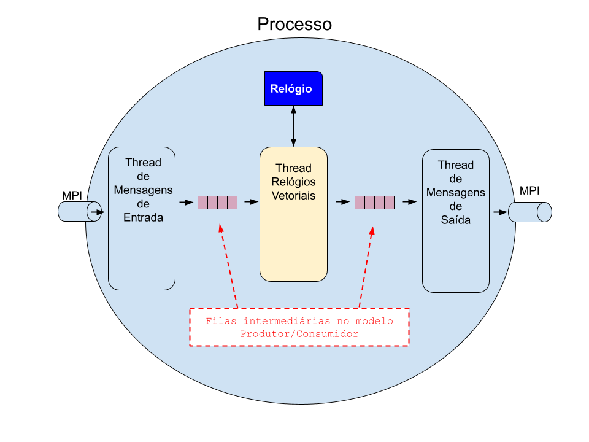

# **Implementação de relógio vetorial**

A atividade consiste na implementação de um relógio vetorial usando threads e MPI.
O processo deverá comportar-se como mostra a imagem abaixo:

O relógio implementado deve seguir a imagem modelo abaixo:

Gabriel de Souza Teles
Matheus Lima da Cruz
